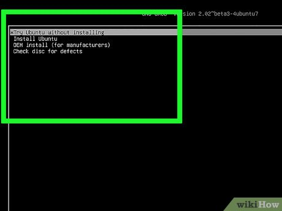

# Instrucciones de Instalación
## En tu computadora
### Opción A. [Experimental] Instala la versión oficial de Ubuntu 18.04LTS para tu computadora y usa nuestro script de instalación completa.
1. Descarga la imagen *Desktop Image* de Ubuntu 18.04LTs de la [página oficial](https://releases.ubuntu.com/18.04/).

2. Haz una memoria usb booteable usando [Balena Etcher](https://www.balena.io/etcher)
Usa este [video](https://www.youtube.com/watch?v=hf4RlArgodw) para guiarte.

3. Posteriormente arranca el sistema operativo desde la memoria usb booteable. Usa este [video](https://www.youtube.com/watch?v=r-rYiUbudFw) como guía. El procedimiento para acceder a la BIOS y interfaz gráfica de la misma son diferentes para cada marca de computadora.

4. Instala git
```
sudo apt install git
```
5. Clona este repositorio
```
cd ~
git clone https://github.com/L4rralde/DonkieTown_EIR_2023.git
```
6. Ejecuta el script de instalación
```
cd ~/DonkieTown_EIR_2023/.ubuntu_iso/
./full_install.sh
```

### Opción B. Prueba nuestra imagen de Ubuntu.
Hemos generado una imagen (archivo .iso) de Ubuntu para que cualquier dispositivo con procesador Intel/AMD pueda utilizar el material del curso sin tener que instalarlo.

1. Descarga la imgen [aquí](https://drive.google.com/file/d/1aLaUVBqgWb4xQuZYf6lOJWrXmu7GLR2S/view?usp=share_link)

2. *flashea* la imagen en una memoria usb (de almenos 8GB) utilizando [balena Etcher](https://www.balena.io/etcher/)

3. Apaga tu computadora, conecta la memoria usb y reiniciala.

4. Accede a la configuración de Arranque del sistema operativo desde la bios y establece a la memoria usb como el primer método de arranque.

5. Cuando arranque Ubuntu, no lo instales, sólo "pruébalo" (opción *Try Ubuntu*)


Listo, ya no deberias preocuparte por instalar algún programa

### Opción C. Jupyter notebooks
Sabemos que Ros Melodic y Ubuntu 18 son versiones ya despreciadas. Sin embargo, como tanto AutoMiny como DonkieTown funcionan sobre estas, decidimos usar Jupyter Notebook como interfaz entre cualquier computadora (con un navegador) y las computadoras de los vehículos. Entonces todo lo que necesitas es un navegador. La desventaja de hacerlo así es que no podrás usar los programas gráficos de ROS, así que recomendamos ampliamente la primera opción.

Las instrucciones que usamos para habilitar Jupyter notebooks y Jupyter Lab las puedes encontrar [aquí](../.jupyter/README.md).

### Opción D. [FUTURO] Usa nuestro contenedor con Docker.

## Software de conducción
No es necesario que instales en tu computadora el software de conducción porque cualquiera de los dos modelos de vehículos empleados (Asinus Car y AutoMiny) en este curso son capaces de procesar toda la información por su cuenta.

### Asinus Car
El Asinus Car es el modelo de vehpiculo inteligente distribuido en DonkieTown. Hasta el momento, tenemos 3 Asinus Cars y son todos vehículos diferenciales. El repo oficial De DonkieTown lo puedes encontrar [aquí](https://github.com/L4rralde/DonkieTown).

### AutoMiny
AutoMiny es un vehículo inteligente a escala hecho para la educación. La plataforma fue creada en la Universidad Libre de Berlín. A través de un consorcio de Inteligencia Artificial de CONACyT, se donarron dos AutoMinys al CIMAT Zacatecas, pero no se ha hecho una actualización de ROS desde entonces y sigue funcionando con ROS Melodic. La wiki oficial más actualizada del AutoMiny la puedes encontrar [aquí](https://autominy.github.io/AutoMiny/). El repositorio de la versión ROS Melodic está en este [enlace](https://github.com/AutoMiny/AutoMiny/tree/melodic).